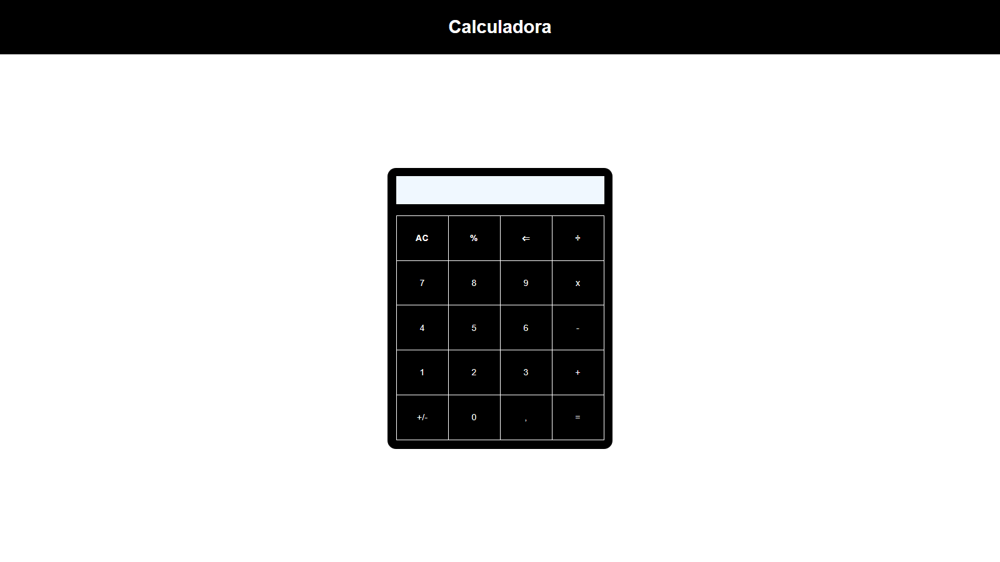

# Calculadora

Clássico projeto de lógica de programação - Calculadora com JavaScript Vanilla.

## Sobre

Por ser um dos primeiros projetos que fiz, deixei salvo o [arquivo](./oldScript.js) com a primeira resolução do desafio que cheguei quando estava começando na programação.\
Aproveitei que estava revisando meus projetos no [GitHub](https://github.com/DiegoVitorGomesDias) e refiz o desafio com o conhecimento que adquiri até o final do ano de 2022.

Um atento importante:\
Na primeira versão [(oldScript.js)](./oldScript.js) deu +/- 150 linhas de código.\
Na segunda versão [(newScript.js)](./newScript.js) deu +/- 60 linhas de código.\
A diferença das linhas de código, sintaxe, funções e estruturação mostram nitidamente minha evolução com o JavaScript Vanilla. 

Outro desafio foi fazer a responsividade da calculadora, na qual foi construída como uma tabela.